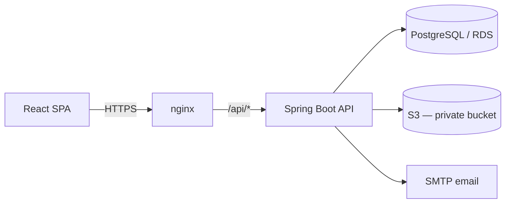

# TutorLink Backend

Spring Boot REST API powering [TutorLink](https://tutorlink.dev), a peer tutoring platform for University of Queensland students. Handles authentication, tutor profiles, course search, bookings, reviews, and image storage.
 
**Live:** https://tutorlink.dev · **Frontend:** [TutorLinkFrontEnd](https://github.com/jameswilmiller/TutorLinkFrontEnd)
 
> TutorLink is an independent personal project and is not affiliated with, endorsed by, or connected to the University of Queensland.
> 
## Overview
 
Students search for tutors by course code, faculty, lesson mode, or proximity, then request bookings for online or in-person sessions. Tutors manage a public profile — bio, hourly rate, courses, credentials, teaching styles, languages — and accept, decline, complete, or cancel incoming bookings. Completed bookings unlock a one-time student review, which feeds each tutor's aggregate rating.
 
- 120+ seeded UQ courses across all five faculties
- JWT authentication with email verification and refresh-token rotation
- Private S3 image storage served via presigned URLs
- Full booking lifecycle with state-based permissions
  
## Architecture
 

 
The API is stateless and containerised; nginx terminates TLS and routes traffic. The system is a deliberate monolith — the domain size doesn't justify distributed complexity, and a single deployable unit keeps debugging and iteration fast. Packages are separated by feature, so individual domains could be extracted later if ever warranted.
 
Full topology, request lifecycle, and auth flow: [`docs/architecture.md`](docs/architecture.md).

## Tech Stack
 
| Component | Choice |
| --- | --- |
| Language | Java 25 |
| Framework | Spring Boot 4 (Web MVC, Data JPA, Security, Validation, Mail) |
| Build | Gradle |
| Database | PostgreSQL |
| Auth | JJWT — access + refresh token pattern, BCrypt hashing |
| Storage | AWS S3 (AWS SDK v2), Apache Tika for upload validation |
| Testing | JUnit 5, Spring Boot Test, Testcontainers |
| CI/CD | GitHub Actions → Docker Hub → AWS EC2 |
| Infra | Docker, nginx, AWS RDS, Let's Encrypt |

## Project Structure
 
Packages are organised by feature rather than by layer — each domain owns its controller, service, repository, DTOs, and mapper.
 
```text
src/main/java/com/tl/tutor_link/
├── auth/           registration, login, JWT, refresh tokens, email verification
├── user/           user accounts and roles
├── tutor/          profiles, search, courses, enquiries
├── booking/        booking lifecycle and state transitions
├── review/         reviews and rating aggregates
├── image/          S3 upload, validation, presigned URLs
├── notification/   outbound email
└── common/         config, constants, exception handling
```

## API Overview
 
Resources are grouped by domain; all mutating endpoints require a bearer token.
 
| Group | Covers |
| --- | --- |
| `/auth` | signup, login, email verification, resend code, token refresh |
| `/users` | current user, become-tutor role upgrade |
| `/tutors` | paginated search with filters, profile by slug, own-profile CRUD, enquiries |
| `/courses` | course search for autocomplete |
| `/bookings` | create, accept, decline, complete, cancel, meeting details |
| `/reviews` | create review for a completed booking, list own reviews |
| `/upload` | profile image upload |
 
Request/response shapes, error envelope, and pagination conventions: [`docs/api.md`](docs/api.md).

## Data Model
 
Core entities: **User** (1–1) **Tutor**, which holds collections of courses (many-to-many), faculties, languages, teaching styles, and credentials. **Booking** links a student, a tutor, and a course through a status lifecycle (`PENDING → ACCEPTED/DECLINED → COMPLETED/CANCELLED`); a completed booking permits exactly one **Review**, whose scores are denormalised onto the tutor as aggregate rating fields. **RefreshToken** persists per-device sessions with revocation support.
 
Full ERD and schema reasoning: [`docs/data-model.md`](docs/data-model.md).
 
## Local Development
 
### Prerequisites
 
- Java 25
- Docker 
- Gradle
  
### Setup
 
```bash
git clone https://github.com/jameswilmiller/TutorLinkBackEnd.git
cd TutorLinkBackEnd
cp .env.example .env    # fill in the values below
./gradlew bootRun
```
 
The API starts at `http://localhost:8080`. On first run against an empty database, Hibernate creates the schema and the seeder populates the course catalogue and demo tutors.
 
To run the full product, start the [frontend](https://github.com/jameswilmiller/TutorLinkFrontEnd) as well — its README covers setup, and the backend's CORS config must allow `http://localhost:5173` (it does by default in the dev profile).

### Environment variables
 
| Variable | Purpose |
| --- | --- |
| `DB_URL` / `DB_USERNAME` / `DB_PASSWORD` | PostgreSQL connection |
| `JWT_SECRET` | Token signing key — generate with `openssl rand -base64 32` |
| `AWS_ACCESS_KEY_ID` / `AWS_SECRET_ACCESS_KEY` / `AWS_S3_BUCKET_NAME` | S3 profile image storage |
| `MAIL_USERNAME` / `MAIL_PASSWORD` | SMTP for verification and enquiry emails. Gmail works with an App Password (requires 2FA; a normal account password will not work) |
 
Token lifetimes and CORS origins are configured in `application.properties`. Local development uses `ddl-auto: update`; production uses `validate` so Hibernate never mutates the deployed schema.
 
### Testing
 
```bash
./gradlew test
```
 
Integration tests run against a real PostgreSQL container via Testcontainers rather than an in-memory database, so queries, constraints, and native SQL are exercised on the same engine used in production.
 
## Notable Implementation Details
 
**Image upload pipeline.** Uploads pass a three-stage chain before reaching S3: declared size and content-type checks, true content-type detection with Apache Tika (a renamed `.exe` is rejected regardless of extension), then a full decode and re-encode to a clean JPEG. Re-encoding strips EXIF metadata and any embedded payload, the stored bytes are bytes this service generated. Each upload gets a fresh UUID key, and the previous object is deleted only after the database write succeeds.
 
**Private image storage.** The S3 bucket blocks all public access. Images are returned as short-lived presigned GET URLs generated per response, so image access follows the same authorisation path as the rest of the API instead of relying on unguessable URLs.
 
**Dynamic search.** Tutor search composes JPA Specifications, so course code, faculty, location, and lesson mode combine in any subset without a combinatorial explosion of repository methods. Proximity filtering runs as a native query returning matching IDs, folded back into the same Specification chain.
 
**Denormalised rating aggregates.** Tutors carry `reviewCount` and `averageRating` alongside the review table. Search results paginate and sort by rating; computing averages per row per page would cost an aggregate query each, so the counters update transactionally when a review is written.
 
**Refresh-token sessions.** Access tokens are short-lived and stateless; refresh tokens are persisted per device with revocation support, so a stolen access token expires quickly and a compromised session can be killed server-side without invalidating the user's other devices.
 
**Deploy and rollback.** Every image is tagged with both `latest` and the commit SHA, so rolling back is a tag change and a container restart rather than a revert-and-rebuild cycle.
 
## Deployment
 
Pushes to `main` trigger tests, a Docker image build, a push to Docker Hub, and a deploy to AWS EC2, where nginx terminates TLS and proxies `/api/*` to the container. The database is AWS RDS in a private subnet, reachable only from the application host.
 
## Known Limitations
 
- Tutor credentials are self-reported; there is no formal verification step
- Payment happens off-platform, arranged directly between student and tutor
- Schema migrations rely on Hibernate (`validate` in production); Flyway is planned
- No admin dashboard — moderation is manual
- current SMTP setup can only handle up to 500 recipients per day, limited by gmail.
  
## Documentation
 
Architecture, data model, API conventions, and design decision records: [`docs/`](docs/).
 
## Author
 
James Miller — [jameswil.miller@gmail.com](mailto:jameswil.miller@gmail.com)
 
